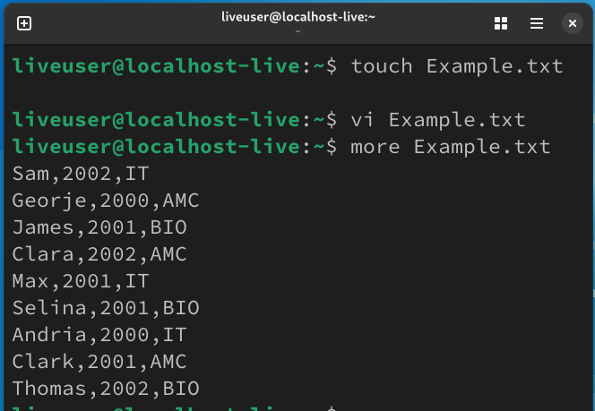
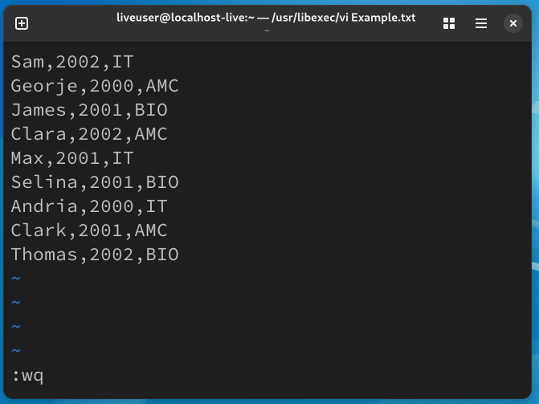
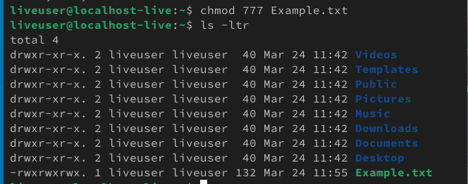
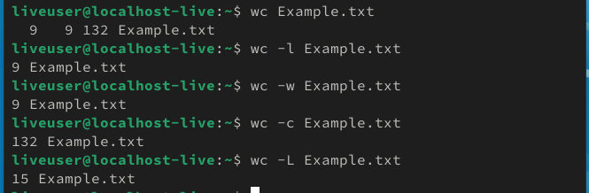
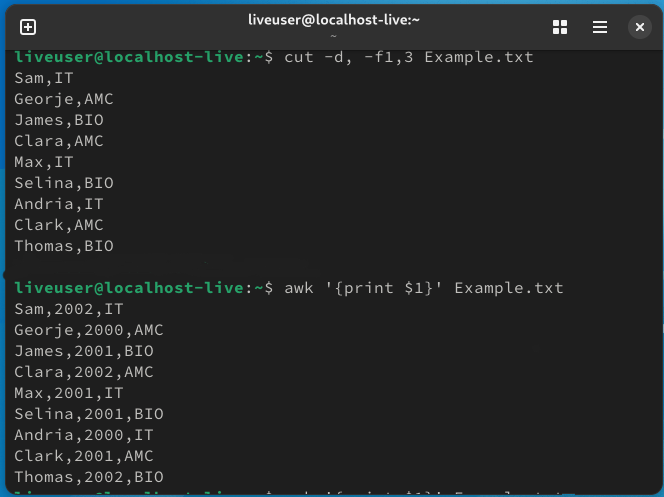
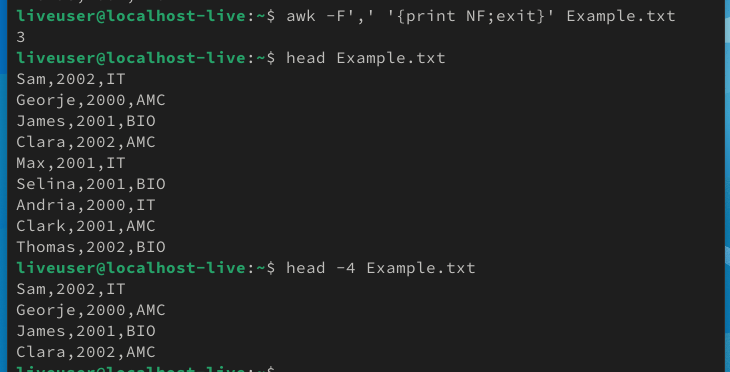
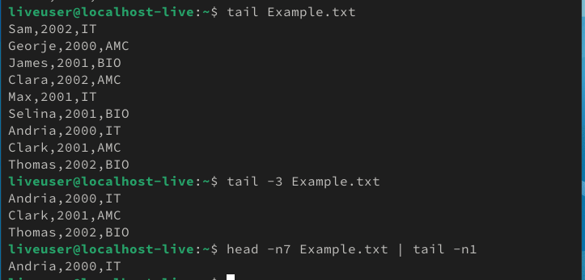

  ## CMD Commands
  | Codes | Output |
  |-------|--------|
  |['Test.bat'](./CMD_Commands/Codes/Test.bat)||
  |['PrintDetails.bat'](./CMD_Commands/Codes/PrintDetails.bat)||
  ['AgeCalculator.bat'](./CMD_Commands/Codes/AgeCalculator.bat)||
  ['DateTime.bat'](./CMD_Commands/Codes/DateTime.bat)||

  ## Linux Commands

  | Codes | Output |
  |-------|--------|
  |['Linux_Commands.txt'](./Linux_Commands/Codes/Linux_Commands.txt)||
  | ||
  | ||
  | ||
  | ||
  | ||
  | ||
  | ||
