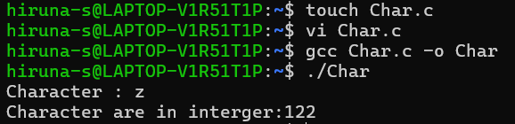

| Codes | Output |
|-------|--------|
|['Hello_World.c'](./Codes/Hello_World.c)||
|['Integer.c'](./Codes/Intege.c)||
|['Float.c'](./Codes/Float.c)||
|['Char.c'](./Codes/Char.c)||
|['User_Input.c'](./Codes/User_Input.c)||
|['User_Input_Mul.c'](./Codes/User_Input_Mul.c)||
|['Calculator.c'](./Codes/Calculator.c)||
